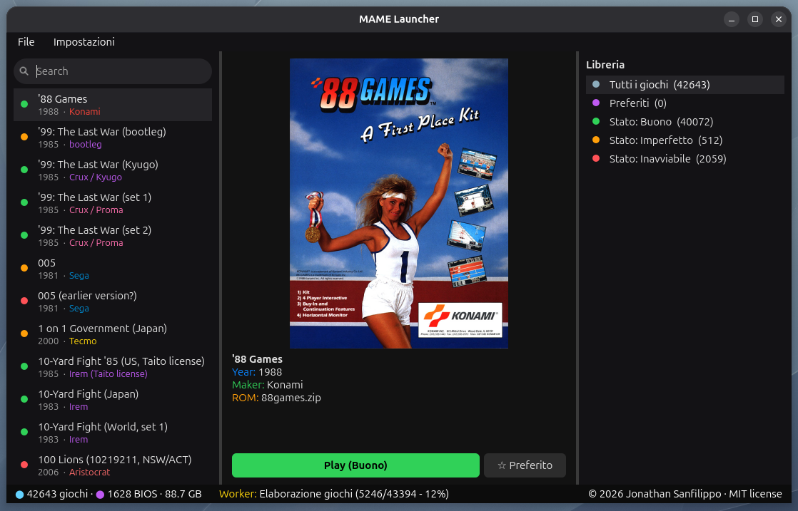

# MAME Launcher

A sleek, lightweight, and modern desktop launcher for **MAME** built with Python and PySide6. It lists your ROM collection from a folder, automatically fetches metadata from MAME, downloads cover art from the Libretro thumbnails repository without needing an API key, extracts vibrant dominant colors for a polished UI look, and launches your games seamlessly.



## Features

- **Automatic ROM Scanning:** Reads standard `.zip` ROM archives from your custom ROM directory.
- **MAME Metadata Integration:** Queries MAME (`-listxml`) to retrieve game titles, release years, manufacturers, clone lineage, and BIOS requirements.
- **Cover Art Downloader:** Automatically fetches box arts, titles, and snapshots from the `libretro-thumbnails` repository.
- **Dynamic Accent Colors:** Computes the dominant color of each game's cover art to style list icons automatically.
- **Favorites:** Mark games as favorites and browse them from the Library sidebar.
- **Flatpak Support:** Works out-of-the-box with the Flatpak version of MAME, handling sandbox folder permissions automatically.
- **Native MAME Support:** Can also launch a native `mame` binary from `PATH`, toggled under **Settings → Esegui MAME**.
- **Persistent Caching:** Caches metadata, settings and images locally in `~/.config/mame_launcher` for instant startups.
- **Clean XVB-inspired Dark Theme:** Custom styled widgets, pill search bar, and full-screen toggle support.

## Requirements

- Python 3.8+
- [PySide6](https://pypi.org/project/PySide6/)
- MAME installed as a native binary (`mame`) or via Flatpak (`org.mamedev.MAME`)

## Installation (Debian / Ubuntu / Mint)

1. Clone or download this repository.
2. Install the dependencies:
```bash
   sudo apt install python3 python3-pyside6.qtcore python3-pyside6.qtgui python3-pyside6.qtwidgets
```
3. Install MAME (pick one):
```bash
   # native
   sudo apt install mame
   # or Flatpak
   flatpak remote-add --if-not-exists flathub https://dl.flathub.org/repo/flathub.flatpakrepo
   flatpak install flathub org.mamedev.MAME
```

### Alternative: PySide6 via pip

If the `python3-pyside6.*` packages are not available in your distribution:

```bash
sudo apt install python3-venv libxcb-cursor0
python3 -m venv ~/venv_mame
~/venv_mame/bin/pip install PySide6
```

## Usage

```bash
python3 z.mame.py
```

(or `~/venv_mame/bin/python z.mame.py` if you used the pip method)

On your first launch, you will be prompted to select your **ROM folder** and optionally your **BIOS folder**. You can also update these paths at any time via the **Settings** menu.

### Launching MAME: native vs Flatpak

Under **Settings → Esegui MAME** pick how MAME is launched:
- **Comando nativo (mame)** — uses the `mame` binary from `PATH`.
- **Flatpak (org.mamedev.MAME)** — uses `flatpak run org.mamedev.MAME`; the ROM/BIOS folders are exposed to the sandbox automatically.

The choice persists in `settings.json`.

## Development

The UI-free logic lives in `core.py` (settings/ROM/thumbnail helpers) and is
covered by an offline test suite that needs **no display and no PySide6**:

```bash
pip install -e ".[dev]"        # or: uv venv && uv pip install pytest
python -m pytest tests/ -v     # 34 tests
```

## License

Distributed under the MIT License. See the code headers for more details.